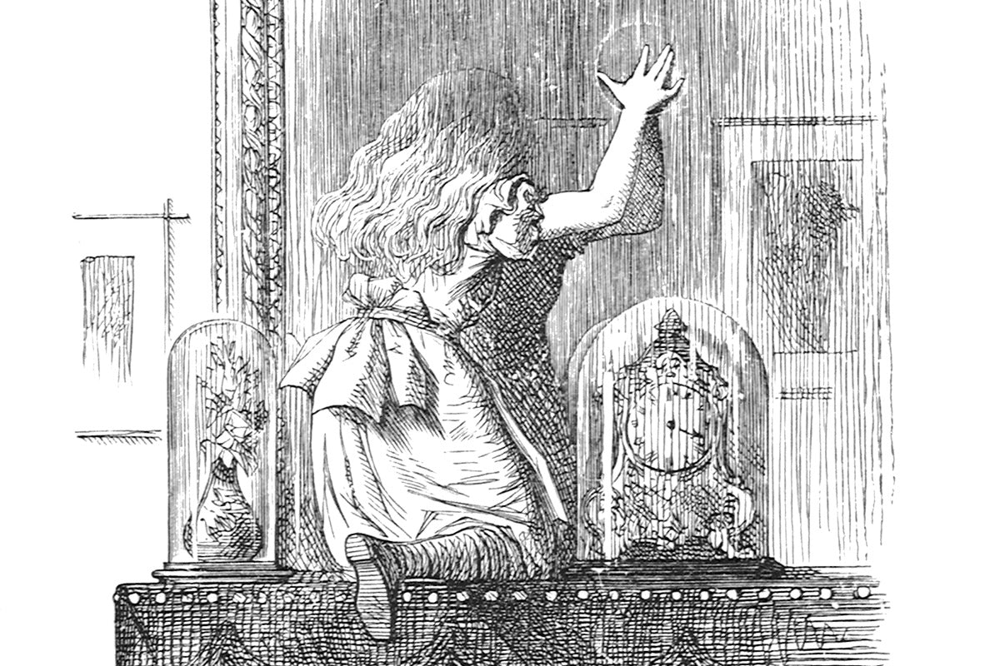

# ALICE
AI-Enabled Lost Information Capture and Exploration 



# Powerpoint Scraper (ppt-scraper.py)

## Requirements
- `python-pptx==0.6.21`
- `click==8.0.3`

You can install these requirements using pip:

```bash
pip install -r requirements.txt
```

## Features

- Extract text from all slides in the PowerPoint presentation
- Extract images from slides and save them to specified folders
- Extract charts from slides and save them to specified folders

```bash
python ppt-scraper.py --pptx [PATH_TO_PPTX] --output [OUTPUT_DIRECTORY] [--text]
```

## Arguments:
- `--pptx`: Path to the PowerPoint file (required).
- `--output`: Path to the output folder where the extracted images and charts will be saved. (default: ./output).
- `--text`: Enable this flag to extract text from the PowerPoint slides.

### Example:
To extract images and charts from a presentation:

```bash
python ppt-scraper.py --pptx sample.pptx --output extracted_data
```

### Note

The images will be organized in separate folders based on their respective slide numbers. Each image or chart will be saved with a prefix `image_` or `chart_` followed by a number indicating its order of extraction.
